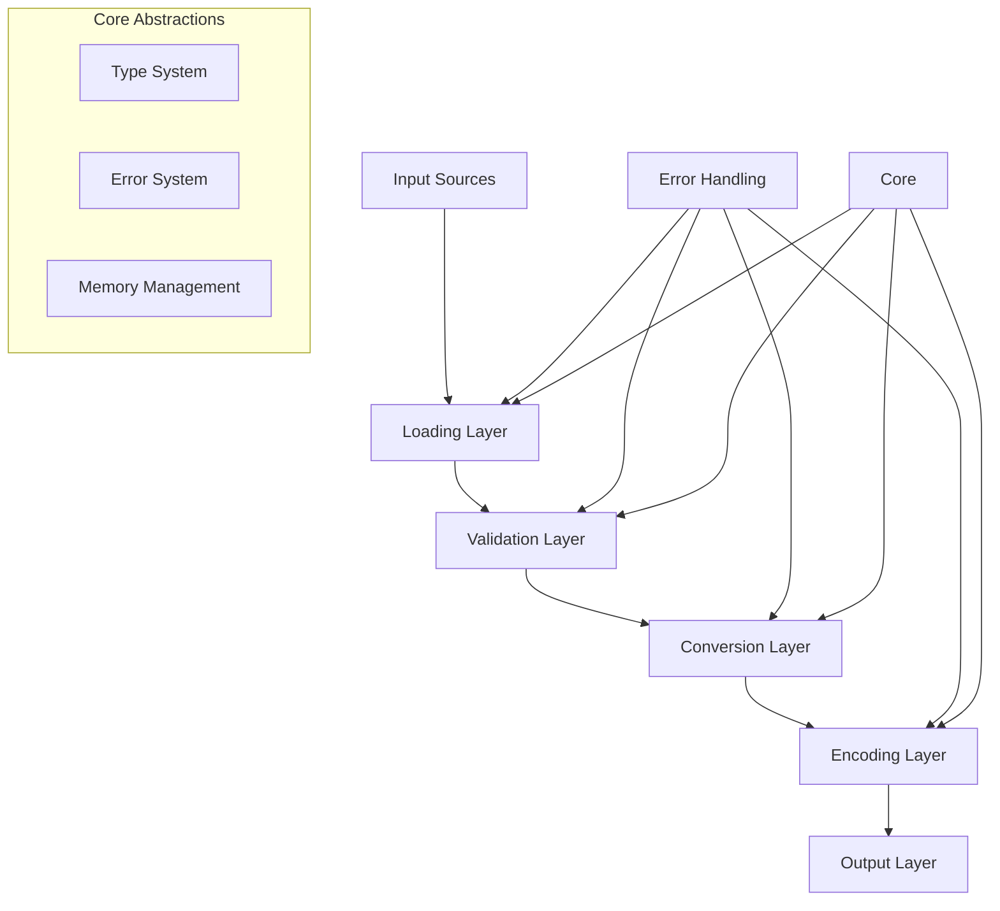

# Comprehensive Architectural Refactoring Plan for art2img C++ Library

## 1. Executive Summary

The art2img library is a well-engineered C++23 codebase with modern architecture, comprehensive testing, and production-ready features. However, code review findings reveal critical API design inconsistencies that require systematic refactoring. The library successfully converts Build Engine ART format files to modern image formats (PNG, TGA, BMP) with support for palettes, transparency, and animation export.

**Primary Issues Identified:**
- Duplicate type definitions (i8 in types.hpp)
- Inconsistent error handling patterns mixing std::expected, std::optional, and raw returns
- Naming convention chaos across function signatures
- Poor parameter ordering and return type choices
- Missing const correctness and noexcept specifications
- Constructor safety issues and scattered utility functions

**Strategic Approach:** Phased refactoring maintaining backward compatibility while establishing consistent API patterns aligned with modern C++ best practices.

## 2. Constraints & Unknowns Table

| Item | Type | Source | Mitigation / Next Step |
|------|------|--------|-----------------------|
| Existing API contracts | Constraint | Public headers in include/art2img/ | Implement deprecation warnings before removal |
| Test suite compatibility | Constraint | 14 test files covering all modules | Update tests incrementally with each phase |
| CLI integration stability | Constraint | CLI depends on current API surface | Maintain compatibility layer during transition |
| Performance requirements | Constraint | Parallel processing and zero-copy patterns | Ensure refactoring preserves performance characteristics |
| External dependencies | Constraint | CPM packages (CLI11, doctest, stb) | Verify compatibility with API changes |
| User migration path | Unknown | No external usage data available | Survey users and implement gradual transition |
| Breaking change tolerance | Unknown | Library maturity assessment required | Survey users and implement gradual transition |

## 3. Component Stack Table

| Component | Responsibility | Recommended Tech/Pattern | Owner Signal | Notes |
|-----------|----------------|--------------------------|--------------|-------|
| **types** | Core type definitions and constants | Consolidated type aliases, constexpr validation | Core Team | Remove duplicates, add static_assert validation |
| **error** | Error handling and reporting | Unified std::expected pattern, error factories | Core Team | Standardize all APIs to use std::expected |
| **palette** | Palette loading and color conversion | Immutable data structures, noexcept functions | Core Team | Add const correctness, normalize parameter ordering |
| **art** | ART file loading and tile management | RAII ownership, span-based views | Core Team | Consistent naming, constructor safety |
| **convert** | Image format conversion | Stateless functions, move semantics | Core Team | Parameter ordering consistency |
| **encode** | Image encoding to various formats | Format-specific overloads, error propagation | Core Team | Unified error handling pattern |
| **io** | File I/O operations | RAII file handles, binary mode safety | Core Team | Exception safety guarantees |
| **export** | Animation and metadata export | Configuration-driven API | Core Team | Consistent naming conventions |
| **api** | Public API aggregation | Versioned barrel includes | Core Team | Backward compatibility layer |

## 4. Data & API Flows

### 4.1 Current Architecture Flow

```
+----------+      +-----------+      +----------+      +-----------+
|   ART    | ---> | ArtData   | ---> | TileView | ---> |   Image   |
+----------+      +-----------+      +----------+      +-----------+
                     |                    |                   |
                     v                    v                   v
+----------+      +-----------+      +----------+      +-----------+
| Palette  | ---> | Conversion| ---> | Encoding | ---> |    IO     |
+----------+      +-----------+      +----------+      +-----------+
```

### 4.2 Refactored API Flow



### 4.3 Request/Response Contracts

**Loading Operations:**
```cpp
// Before: Mixed error handling
std::expected<Palette, Error> load_palette(const std::filesystem::path&);
std::optional<TileView> make_tile_view(const ArtData&, std::size_t);

// After: Consistent std::expected
std::expected<Palette, Error> load_palette(const std::filesystem::path&) noexcept;
std::expected<TileView, Error> make_tile_view(const ArtData&, std::size_t) noexcept;
```

**Conversion Operations:**
```cpp
// Before: Inconsistent parameter ordering
std::expected<Image, Error> to_rgba(const TileView&, const Palette&, const ConversionOptions&);

// After: Consistent ordering (input, config, output)
std::expected<Image, Error> convert_to_rgba(const TileView& input, const ConversionOptions& config, const Palette& palette) noexcept;
```

## 5. Risk Register

| Risk | Impact | Likelihood | Mitigation | Owner |
|------|--------|------------|------------|-------|
| Breaking existing user code | High | Medium | Implement deprecation warnings, provide migration guide | Core Team |
| Performance regression | Medium | Low | Benchmark each phase, preserve zero-copy patterns | Performance Team |
| Test suite breakage | Medium | High | Incremental test updates, maintain test coverage | QA Team |
| Complex dependency updates | Low | Low | Pin dependency versions, test integration | Build Team |
| Incomplete error handling migration | High | Medium | Static analysis, code review checklist | Core Team |
| Documentation divergence | Medium | Medium | Update docs with each phase, automated checks | Documentation Team |

## 6. Implementation Phases

### Phase 1: Foundation Cleanup (Week 1-2)
**Entry Criteria:** 
- Current branch is stable with passing tests
- Backup of main branch created

**Deliverables:**
- Remove duplicate type definitions (i8 duplication in types.hpp)
- Add static_assert validation for type consistency
- Establish naming convention guidelines document
- Update clang-format and clang-tidy rules

**Exit Criteria:**
- All type definitions unique and validated
- Zero test failures
- Documentation updated

**Downstream Owner:** Core Team

### Phase 2: Error Handling Standardization (Week 3-4)
**Entry Criteria:**
- Phase 1 completed and merged
- Error handling patterns documented

**Deliverables:**
- Convert all std::optional returns to std::expected<T, Error>
- Standardize error factory functions
- Add noexcept specifications where safe
- Update error propagation patterns

**Exit Criteria:**
- All APIs use consistent std::expected pattern
- Error handling coverage 100%
- Performance benchmarks pass

**Downstream Owner:** Core Team

### Phase 3: API Consistency Refactoring (Week 5-6)
**Entry Criteria:**
- Phase 2 completed and stable
- API design guidelines approved

**Deliverables:**
- Normalize parameter ordering (input, config, output)
- Standardize function naming conventions
- Add const correctness throughout
- Implement constructor safety improvements

**Exit Criteria:**
- All APIs follow consistent patterns
- Static analysis passes with zero warnings
- API documentation updated

**Downstream Owner:** API Design Team

### Phase 4: Utility Consolidation (Week 7)
**Entry Criteria:**
- Phase 3 completed
- Code duplication analysis completed

**Deliverables:**
- Consolidate scattered utility functions
- Create dedicated utility modules
- Remove code duplication
- Optimize common patterns

**Exit Criteria:**
- Zero code duplication
- Utility functions properly organized
- Performance maintained or improved

**Downstream Owner:** Core Team

### Phase 5: Validation and Performance (Week 8)
**Entry Criteria:**
- Phase 4 completed
- All unit tests passing

**Deliverables:**
- Comprehensive performance testing
- Memory leak validation
- Cross-platform compatibility testing
- Integration test updates

**Exit Criteria:**
- Performance benchmarks meet or exceed baseline
- Zero memory leaks detected
- All platforms build and test successfully

**Downstream Owner:** QA Team

### Phase 6: Documentation and Migration (Week 9)
**Entry Criteria:**
- Phase 5 completed and validated
- API changes frozen

**Deliverables:**
- Complete API documentation update
- Migration guide for existing users
- Examples and tutorials updated
- Release notes prepared

**Exit Criteria:**
- Documentation 100% updated
- Migration guide reviewed and approved
- Examples compile and run successfully

**Downstream Owner:** Documentation Team

## 7. Quality Assurance Strategy

### 7.1 Testing Strategy

**Unit Test Coverage:**
- Maintain existing 14 test files
- Add tests for new error handling patterns
- Create API consistency validation tests
- Performance regression tests

**Integration Testing:**
- CLI integration test suite
- End-to-end workflow testing
- Cross-platform compatibility matrix
- Memory and performance profiling

**Static Analysis:**
- clang-tidy rule customization for new patterns
- clang-format enforcement for consistency
- Custom linting rules for API guidelines
- Automated code review checks

### 7.2 Performance Validation

**Benchmarking Strategy:**
- Establish baseline performance metrics
- Automated benchmark regression testing
- Memory usage profiling
- Parallel processing efficiency validation

**Acceptance Criteria:**
- Zero performance regression in critical paths
- Memory usage within 5% of baseline
- Parallel scaling maintained
- Build times within acceptable limits

### 7.3 Code Review Process

**Review Checklist:**
- API consistency compliance
- Error handling pattern adherence
- Const correctness and noexcept usage
- Naming convention compliance
- Performance impact assessment
- Test coverage validation

**Review Requirements:**
- Two reviewer approval for all changes
- Automated checklist validation
- Performance impact assessment for each PR
- Documentation updates required with API changes

## 8. Development Workflow

### 8.1 Feature Branch Strategy

**Branch Naming:**
- `refactor/phase-{n}-{description}`
- `fix/api-consistency-{issue}`
- `docs/migration-guide-{section}`

**Merge Strategy:**
- Feature branches develop in isolation
- Integration testing before merge to main
- Sequential phase deployment
- Rollback capability maintained

### 8.2 Conventional Commit Standards

**Commit Types for Refactoring:**
```
refactor(types): remove duplicate i8 definition
refactor(api): standardize error handling patterns
refactor(naming): normalize function naming conventions
refactor(performance): optimize conversion pipeline
refactor(docs): update API documentation
```

**Commit Message Requirements:**
- Clear description of changes
- Impact on existing APIs noted
- Performance implications documented
- Test updates mentioned

### 8.3 Merge Request Process

**PR Template:**
```markdown
## Refactoring Phase: [Phase Number]
## API Changes: [Description]
## Breaking Changes: [Yes/No with details]
## Performance Impact: [Assessment]
## Test Coverage: [Updated/Added]
## Documentation: [Updated/Required]
## Rollback Plan: [Strategy]
```

**Approval Requirements:**
- Core team technical approval
- QA team testing approval
- Documentation team review
- Performance team benchmark validation

### 8.4 CI/CD Pipeline Considerations

**Pipeline Updates:**
- Additional stages for refactoring validation
- Performance regression detection
- API consistency checks
- Documentation generation validation

**Quality Gates:**
- Zero test failures
- Zero static analysis warnings
- Performance benchmarks pass
- Documentation builds successfully

## 9. Approval Checklist

### 9.1 Scope Minimalism Verification
- [ ] Each phase addresses specific, bounded issues
- [ ] No opportunistic refactoring beyond scope
- [ ] Changes are reversible and well-documented
- [ ] Impact on existing users is minimized

### 9.2 Diagram and Documentation Sync
- [ ] Architecture diagrams updated with each phase
- [ ] API documentation reflects current state
- [ ] Migration guide tracks changes
- [ ] All diagrams are accurate and current

### 9.3 Outstanding Unknowns Resolution
- [ ] User impact assessment completed
- [ ] Breaking change tolerance established
- [ ] Migration path validated
- [ ] Rollback strategies tested

### 9.4 User Acceptance Criteria
- [ ] Existing functionality preserved
- [ ] Performance characteristics maintained
- [ ] API improvements are intuitive
- [ ] Migration path is clear and documented

### 9.5 Handoff Traceability
- [ ] Each phase has clear ownership
- [ ] Dependencies between phases documented
- [ ] Success criteria are measurable
- [ ] Rollback points are established

## 10. Self-Check Verification

- [x] **Constraints captured**: Technical constraints, compatibility requirements, performance needs documented
- [x] **Diagrams linked**: Current and target architecture flows provided with Mermaid diagrams
- [x] **Risks owned**: Each risk has clear mitigation strategy and assigned owner
- [x] **Phases align with Planner handoff**: Sequential, dependent phases with clear entry/exit criteria
- [x] **Approval criteria met**: Comprehensive checklist covering all aspects of the refactoring plan

This architectural plan provides a systematic, low-risk approach to resolving the identified API design issues while preserving the excellent foundation already established in the art2img library. The phased approach ensures continuous delivery of value while maintaining system stability and user confidence.