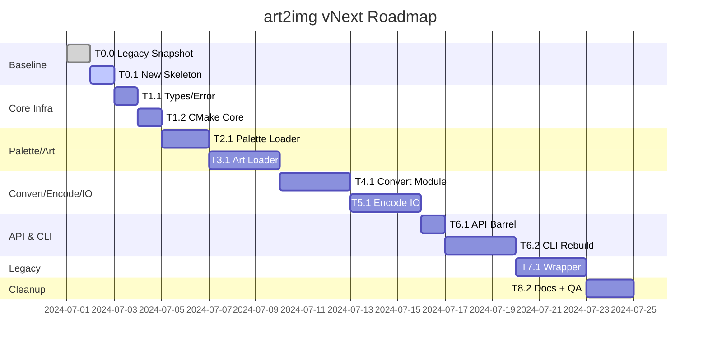

# art2img vNext — Implementation Roadmap (LLM Friendly)

Every task below is self-contained and written so an autonomous code agent can execute it end-to-end. Tasks are grouped into milestones that must land in order. Each task includes inputs, actions, outputs, acceptance criteria, and any diagrams or flow hints needed. All paths are relative to repository root.

---

## Legend

- **Inputs** – Files/resources the agent must inspect or move.
- **Actions** – Ordered list of subtasks. Follow sequentially unless otherwise stated.
- **Outputs** – Files/artifacts that must exist or be updated when the task completes.
- **Acceptance** – Validation steps (tests, lints, checks) to run.
- **Notes** – Warnings, heuristics, or diagrams.

---

## Milestone 0 — Repository Rebaseline

### T0.0 – Snapshot existing tree to `repository/legacy`
- **Inputs:** Entire repo except `AGENTS.md`, `QWEN.md`, `docs/plan/*` (keep current plan docs in place).
- **Actions:**
  1. Create directory `repository/legacy`.
  2. Move all existing source/test/build/cmake/scripts files under `repository/legacy` preserving structure.
  3. Leave planning docs (`docs/plan/*.md`), `AGENTS.md`, `QWEN.md`, and tooling configs (optionally) at root.
  4. Add placeholder `.keep` files if needed to maintain empty dirs.
- **Outputs:**
  - `repository/legacy/<previous tree>` mirrors original layout.
  - Root tree contains only planning docs, AGENTS/QWEN, and new architecture implementation files as they are created later.
- **Acceptance:**
  - `git status` shows all non-plan files relocated; no accidental deletions.
  - `repository/legacy` builds/tests can still run once we wire legacy shim (future tasks).
- **Notes:**
  - Update `.gitignore` if necessary.
  - Maintain executable bits and symlinks.

### T0.1 – Scaffold fresh project tree
- **Inputs:** `docs/plan/architecture.md`, `docs/plan/tasks.md`.
- **Actions:**
  1. Create directories: `include/art2img`, `src`, `tests`, `cmake` scaffolding for new core.
  2. Prepare minimal `CMakeLists.txt` referencing upcoming modules, set `CMAKE_CXX_STANDARD 23`.
  3. Add placeholder README note referencing ongoing refactor.
- **Outputs:** Skeleton tree ready for new modules (`include/art2img/*.hpp`, `src/*.cpp`, `tests/*`).
- **Acceptance:** Root `CMakeLists.txt` configures without errors (even if no targets yet).
- **Notes:** Keep existing scripts under `repository/legacy` untouched.

---

## Milestone 1 — Core Infrastructure

### T1.1 – Implement `types.hpp`
- **Inputs:** Architecture section 4, constants inventory.
- **Actions:**
  1. Define palette/image constants in `include/art2img/types.hpp`.
  2. Add unit test verifying constants when necessary.
- **Outputs:** `include/art2img/types.hpp`, optional `tests/core/types/test_constants.cpp`.
- **Acceptance:** Test compile (no runtime tests needed yet).

### T1.2 – Implement `error.hpp`
- **Inputs:** Architecture section 4.1.
- **Actions:**
  1. Define `errc` enum, custom error category, `Error` struct, helper functions returning `std::expected<std::monostate, Error>` failure objects.
  2. Add unit tests for error code conversion, message formatting.
- **Outputs:** `include/art2img/error.hpp`, `src/error.cpp`, tests under `tests/core/error`.
- **Acceptance:** Unit tests pass (`ctest` subset).

### T1.3 – Hook core target in CMake
- **Inputs:** New headers (`types.hpp`, `error.hpp`).
- **Actions:**
  1. Create `art2img_core` library target exporting headers.
  2. Add install/export rules and interface compile definitions.
- **Outputs:** Updated `CMakeLists.txt` with `art2img_core` target.
- **Acceptance:** `cmake --build` (configured) succeeds.

---

## Milestone 2 — Palette Module

### T2.1 – Implement palette loader
- **Inputs:** Architecture sections 4.2, 9 (palette notes), sample assets under `repository/legacy` (e.g., `tests/assets/PALETTE.DAT`).
- **Actions:**
  1. Write `include/art2img/palette.hpp` API definitions.
  2. Implement `src/palette.cpp` loading from path/span, parsing raw RGB + shade tables + translucent map.
  3. Provide utility functions for palette entry conversion.
 4. Enforce validation rules from Architecture §14 (reject truncated payloads, clamp shade indices).
 5. Write unit tests with real + corrupted PALETTE files (copy fixtures from legacy assets).
- **Outputs:** Header, source, tests (`tests/palette/test_palette.cpp`), fixture referencing legacy asset path.
- **Acceptance:** `cmake --build --target tests` + `ctest -R palette` pass.
- **Notes:** Use `std::filesystem`, `std::span`, `std::expected`. Validate size before reading; map errors to `errc::invalid_palette`.

### T2.2 – Document palette module usage
- **Actions:** Update `docs/plan/architecture.md` (if needed) and add inline comments summarizing palette behaviour.
- **Outputs:** Possibly new doc snippet or inline doc comments.
- **Acceptance:** Documentation reflects final API.

---

## Milestone 3 — ART Module

### T3.1 – Implement `art.hpp` + loader
- **Inputs:** Architecture sections 4.3, 9 (art notes), legacy assets `TILES*.ART`, `LOOKUP.DAT`.
- **Actions:**
  1. Define `TileAnimation`, `TileView`, `ArtData`, `PaletteHint` in header.
  2. Implement loader in `src/art.cpp` for path/span: parse header, metadata, allocate contiguous buffers, build `TileView`s referencing `pixels`/`remaps`.
 3. Implement optional palette hint logic (auto-discover sidecar palette/lookup path resolution separated into helper).
 4. Enforce safety checks from Architecture §14 (offset bounds, width*height consistency, lookup sizes).
 5. Add unit tests for valid/corrupt ART files, verifying metadata, view spans, animation bits.
- **Outputs:** `include/art2img/art.hpp`, `src/art.cpp`, tests `tests/art/test_art_loader.cpp`.
- **Acceptance:** `ctest -R art` passes; memory spans validated (no out-of-range).
- **Notes:** Compare tile ranges to architecture doc; error -> `errc::invalid_art` or `errc::io_failure`.

### T3.2 – Helpers for tile iteration
- **Actions:** Provide helper functions if needed (within `art.cpp`) for `make_tile_view`, tile lookup by Build ID.
- **Outputs:** Additional functions, doc updates.
- **Acceptance:** Tests covering helper behaviour.

---

## Milestone 4 — Conversion Module

### T4.1 – Implement `convert.hpp/.cpp`
- **Inputs:** Architecture section 4.4 & 9.
- **Actions:**
  1. Define `ConversionOptions`, `Image`, `ImageView`, `ColumnMajorRowRange` in header.
 2. Implement `to_rgba`, row-major copy, sampling, row iterator. Handle palette remap, shade, transparency, optional premultiplication while obeying bounds checks from Architecture §14.
 3. Add unit tests verifying pixel parity with known tiles (use fixtures) and edge cases (empty tile, remap errors, out-of-bounds sampling).
- **Outputs:** Header, source, tests `tests/convert/test_convert.cpp`.
- **Acceptance:** `ctest -R convert` passes; memory sanitizers optional.

### T4.2 – Performance sanity check
- **Actions:** Optional benchmarking harness to compare conversion speed vs. legacy (document results or baseline).
- **Outputs:** Bench report (Markdown or test comment) summarizing findings.
- **Acceptance:** No regressions observed (qualitative).

---

## Milestone 5 — Encoding & IO

### T5.1 – Implement `encode.hpp/.cpp`
- **Inputs:** Architecture section 4.5, 9 (encode notes), stb library (from dependencies).
- **Actions:**
  1. Define format enum + option structs + EncodeOptions variant.
 2. Implement encode functions using stb; validate stride/channel metadata before calling stb and map failures to `errc::encoding_failure`.
 3. Add tests verifying encoded output (size, basic headers) and error paths (invalid stride, unsupported format).
- **Outputs:** Header, source, tests `tests/encode/test_encode.cpp` (use small fixture Image).
- **Acceptance:** `ctest -R encode` passes.

### T5.2 – Implement `io.hpp/.cpp`
- **Inputs:** Architecture section 4.5.
- **Actions:**
  1. Provide file read/write helpers returning `std::expected`.
  2. Tests for success, missing file, permission errors (simulate with temporary dir/umask).
- **Outputs:** Header, source, tests `tests/io/test_io.cpp`.
- **Acceptance:** `ctest -R io` passes.

---

## Milestone 6 — Public API & CLI

### T6.1 – Publish `api.hpp`
- **Actions:** Create header including `types`, `error`, `palette`, `art`, `convert`, `encode`, `io`.
- **Outputs:** `include/art2img/api.hpp`.
- **Acceptance:** Build compiles with single include.

### T6.2 – Rebuild CLI on new pipeline
- **Inputs:** Architecture section 6, CLI design from docs/plan.
- **Actions:**
  1. Create new CLI entry under `cli/` referencing `art2img/api.hpp` (fresh implementation, no legacy dependencies).
  2. Implement option parsing (reuse CLI11 dependency), translation into pipeline steps.
  3. Use thread pool (optional) around tile conversion/encoding; ensure sequential fallback works.
  4. Update CLI integration tests (new Bats scripts) to use new binary.
- **Outputs:** `cli/main.cpp`, support files, tests under `tests/cli`.
- **Acceptance:** `ctest -R cli`, manual CLI run on sample ART.

### T6.3 – Update build scripts for new CLI
- **Actions:** Refresh `Makefile`, `scripts` (if needed) to point to new build targets.
- **Outputs:** Updated automation referencing new CLI.
- **Acceptance:** `make all`, `make test` succeed.

---

## Milestone 7 — Legacy Wrapper

### T7.1 – Implement `legacy_api.hpp/.cpp`
- **Inputs:** Legacy code under `repository/legacy`, architecture section 8.
- **Actions:**
  1. Recreate legacy structs denoting old API surfaces in header (ExtractorAPI, ArtFile, Palette, ImageWriter, etc.).
  2. Implement functions in `src/legacy_api.cpp` by forwarding into vNext modules.
  3. Provide translation from `std::expected` to legacy return types (bools/exceptions/ExtractionResult).
  4. Bring over necessary helpers (animation manifest, etc.) in minimal form.
- **Outputs:** Header, source, tests ensuring parity with key legacy scenarios (copy subsets of existing tests from `repository/legacy/tests`).
- **Acceptance:** `ctest -R legacy` passes; old integration tests adapted to new location succeed.

### T7.2 – Legacy toggle
- **Actions:** Add `ART2IMG_ENABLE_LEGACY` option in CMake; conditionally build wrapper/tests.
- **Outputs:** CMake updates, documentation note.
- **Acceptance:** `cmake -DART2IMG_ENABLE_LEGACY=OFF` configures/builds; default ON for transition.

---

## Milestone 8 — Cleanup & Documentation

### T8.1 – Deprecate old sources
- **Actions:** Remove redundant code remaining in root after relocation (if any); ensure `repository/legacy` stays for reference.
- **Outputs:** Clean tree referencing only new modules + legacy wrapper.
- **Acceptance:** `git status` shows removal of unused artifacts.

### T8.2 – Documentation pass
- **Actions:** Update README, migration guide (under `docs/plan/migration_guide.md`), CLI usage instructions, dependency notes.
- **Outputs:** Revised docs reflecting new API, legacy toggle instructions, migration steps.
- **Acceptance:** Docs render cleanly; cross-links valid.

### T8.3 – Final QA sweep
- **Actions:**
  1. `cmake --build` for release + debug configurations.
  2. Run full test suite: `ctest`, Bats, CLI smoke.
  3. Run static analysis (`clang-tidy` profile) and sanitizers (ASAN/UBSAN/LSAN) per Architecture §14.
  4. Package artifacts if part of release flow.
- **Outputs:** QA summary (notes or CI logs) demonstrating green pipeline and clean analysis/sanitizer runs.
- **Acceptance:** All commands succeed; static analysis/sanitizers report zero findings; summary recorded in PR or release notes.

---

## Visual Roadmap

---

## Build/Test Command Cheat Sheet

- Configure: `cmake -S . -B build -DART2IMG_ENABLE_LEGACY=ON`
- Build: `cmake --build build`
- Tests: `cd build && ctest --output-on-failure`
- Sanitizers: `cmake -S . -B build-asan -DART2IMG_ENABLE_LEGACY=ON -DENABLE_ASAN=ON -DENABLE_LEAK_SANITIZER=ON`
- CLI smoke: `./build/bin/art2img --help`

---

## Dependencies & Assets

- Legacy assets remain under `repository/legacy/tests/assets` for reuse in new tests.
- External libs via CPM: CLI11 v2.5.0, doctest 2.4.12, fmt 11.0.2, stb (tagged release).
- Thread pool: evaluate reuse of `BS_thread_pool` or switch to standard `<execution>` once stable (optional).

---

## Acceptance Gate (Final)

To mark the refactor complete:
1. New pipeline (`api.hpp` and modules) is the default include path.
2. CLI uses new pipeline exclusively.
3. Legacy wrapper builds/tests with toggle ON; project builds cleanly with toggle OFF.
4. Documentation, build scripts, examples updated.
5. Full QA (build + test + sanitizers) passes.
