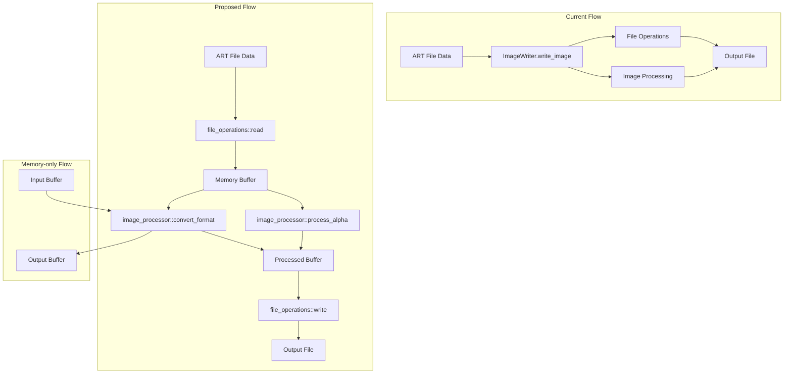

# ImageWriter Module Refactoring Plan

## Current Architecture Analysis

The current [`ImageWriter`](include/image_writer.hpp:15) class combines file I/O operations with image processing logic, violating the Single Responsibility Principle. Key issues identified:

### Current Problems:
1. **Mixed Concerns**: Functions like [`write_png_to_file()`](src/image_writer.cpp:77) and [`write_png_to_memory()`](src/image_writer.cpp:106) handle both file operations and image processing
2. **Code Duplication**: PNG, TGA, and BMP implementations each have their own file/memory variants
3. **Tight Coupling**: Image processing functions like [`convert_to_rgba()`](src/image_writer.cpp:149) are tied to file output concerns
4. **Poor Testability**: Difficult to test image processing logic without file system dependencies

## Proposed Architecture

### Namespace Structure
```cpp
namespace art2img {
namespace file_operations {
    // Pure file I/O operations
}

namespace image_processor {
    // Pure image processing algorithms
}

// Backward compatibility wrapper
class ImageWriter {
    // Maintains existing public API
};
}
```

### Architecture Diagram



## File Operations Namespace Design

### Header: `include/file_operations.hpp`
```cpp
#pragma once
#include <filesystem>
#include <vector>
#include <cstdint>

namespace art2img::file_operations {

struct WriteOptions {
    bool overwrite = true;
    bool create_directories = true;
};

// Generic file operations
bool write_file(const std::filesystem::path& path, 
                const std::vector<uint8_t>& data,
                const WriteOptions& options = {});

std::vector<uint8_t> read_file(const std::filesystem::path& path);

// Format-specific operations (delegates to image_processor)
bool write_png(const std::filesystem::path& path,
               const std::vector<uint8_t>& image_data,
               uint32_t width, uint32_t height,
               const WriteOptions& options = {});

bool write_tga(const std::filesystem::path& path,
               const std::vector<uint8_t>& image_data,
               uint32_t width, uint32_t height,
               const WriteOptions& options = {});

bool write_bmp(const std::filesystem::path& path,
               const std::vector<uint8_t>& image_data,
               uint32_t width, uint32_t height,
               const WriteOptions& options = {});

} // namespace art2img::file_operations
```

## Image Processor Namespace Design

### Header: `include/image_processor.hpp`
```cpp
#pragma once
#include <vector>
#include <cstdint>
#include "palette.hpp"
#include "art_file.hpp"

namespace art2img::image_processor {

struct ProcessingOptions {
    bool enable_alpha = true;
    bool premultiply_alpha = false;
    bool matte_hygiene = false;
    bool fix_transparency = true;
};

// Core processing functions
std::vector<uint8_t> convert_to_rgba(const Palette& palette,
                                     const ArtFile::Tile& tile,
                                     const uint8_t* pixel_data,
                                     size_t pixel_data_size,
                                     const ProcessingOptions& options);

std::vector<uint8_t> convert_to_bgra(const Palette& palette,
                                     const ArtFile::Tile& tile,
                                     const uint8_t* pixel_data,
                                     size_t pixel_data_size,
                                     const ProcessingOptions& options);

std::vector<uint8_t> convert_to_indexed(const Palette& palette,
                                        const ArtFile::Tile& tile,
                                        const uint8_t* pixel_data,
                                        size_t pixel_data_size);

// Alpha processing
void apply_premultiplication(std::vector<uint8_t>& rgba_data);
void apply_matte_hygiene(std::vector<uint8_t>& rgba_data, 
                         int width, int height);

// Format conversion
std::vector<uint8_t> encode_png(const std::vector<uint8_t>& rgba_data,
                                uint32_t width, uint32_t height);

std::vector<uint8_t> encode_tga(const std::vector<uint8_t>& indexed_data,
                                const Palette& palette,
                                uint32_t width, uint32_t height);

std::vector<uint8_t> encode_bmp(const std::vector<uint8_t>& bgra_data,
                                uint32_t width, uint32_t height);

// Utility functions
constexpr bool is_magenta(uint8_t r, uint8_t g, uint8_t b);

} // namespace art2img::image_processor
```

## Shared Common Modules

### Header: `include/image_types.hpp`
```cpp
#pragma once
#include <cstdint>
#include <vector>

namespace art2img {

enum class ImageFormat { PNG, TGA, BMP };

struct ImageBuffer {
    std::vector<uint8_t> data;
    uint32_t width;
    uint32_t height;
    uint32_t channels; // 3 for RGB, 4 for RGBA, 1 for indexed
};

struct ImageMetadata {
    ImageFormat format;
    bool has_alpha;
    bool is_indexed;
};

} // namespace art2img
```

## Migration Strategy

### Phase 1: Create New Namespaces
1. Implement `file_operations` and `image_processor` namespaces
2. Move existing functionality to appropriate namespaces
3. Keep original `ImageWriter` class as compatibility wrapper

### Phase 2: Refactor Internal Usage
1. Update [`extractor_api.cpp`](src/extractor_api.cpp:135) to use new namespaces
2. Update [`cli/helpers.cpp`](cli/helpers.cpp:168) to use new namespaces
3. Maintain backward compatibility through adapter pattern

### Phase 3: Deprecation Planning
1. Mark old `ImageWriter` methods as deprecated with compiler directives
2. Provide migration guide for external users
3. Schedule removal after sufficient transition period

## Breaking Changes Strategy

The refactoring will break backward compatibility to achieve a cleaner architecture. All dependent code will need to be updated to use the new namespaces:

### Migration Required For:
1. [`extractor_api.cpp`](src/extractor_api.cpp:135) - Lines 135, 245
2. [`cli/helpers.cpp`](cli/helpers.cpp:168) - Line 168, 171, 176
3. Any external users of `ImageWriter` class

### Migration Pattern:
```cpp
// OLD:
ImageWriter::write_image(filename, format, palette, tile, pixel_data, size, options);

// NEW:
auto rgba_data = image_processor::convert_to_rgba(palette, tile, pixel_data, size, options);
auto encoded_data = image_processor::encode_format(rgba_data, tile.width, tile.height, format);
file_operations::write_file(filename, encoded_data);
```

### Benefits of Breaking Changes:
- Cleaner, more maintainable architecture
- No legacy wrapper code to maintain
- Clear separation of concerns from the start
- Better performance without indirection

## Benefits of New Architecture

1. **Clean Separation of Concerns**: File I/O and image processing are completely separated
2. **Improved Testability**: Image processing can be tested without file system dependencies
3. **Code Reuse**: Common operations shared across formats with no duplication
4. **Flexibility**: Easy to add new formats without touching core logic
5. **Performance**: Direct memory-based workflows without wrapper overhead
6. **Maintainability**: Smaller, focused functions with single responsibilities
7. **Modern Architecture**: No legacy compatibility constraints holding back design

## Implementation Timeline

1. **Week 1**: Create new namespace headers and core implementations
2. **Week 2**: Completely remove old ImageWriter class and update all internal usage
3. **Week 3**: Update all dependent code to use new architecture
4. **Week 4**: Comprehensive testing and performance benchmarking
5. **Week 5**: Documentation update and major version release

This refactoring will create a modern, maintainable architecture with clear separation between file operations and image processing, free from backward compatibility constraints.