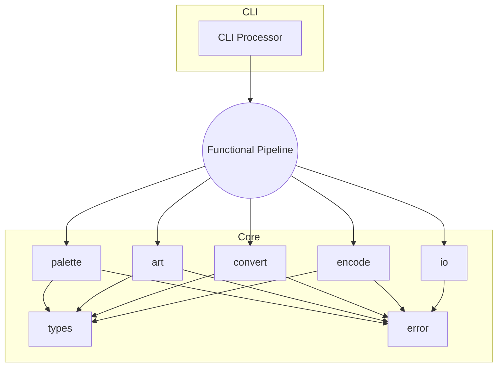
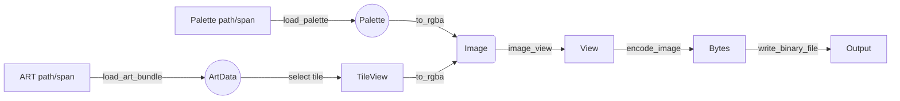

# art2img vNext Architecture (LLM Edition)

This document is the single source of truth for the upcoming `art2img` refactor. Every section is intentionally short, list-driven, and ordered so language models can answer "what/why/how" questions without extensive cross-referencing.

---

## 1. High-Level Summary

- Language: C++23
- Core design: stateless functions + plain structs
- Error handling: `std::expected<T, Error>` everywhere
- Pipeline: palette → art bundle → tile view → RGBA conversion → encoding → IO

---

## 2. Module Map

| Module | Responsibility | Key Headers |
|--------|----------------|-------------|
| `types` | Shared constants and aliases | `include/art2img/types.hpp` |
| `error` | Error codes, `Error` struct, helper factories | `include/art2img/error.hpp` |
| `palette` | Load `PALETTE.DAT`, expose immutable palette data | `include/art2img/palette.hpp` |
| `art` | Load ART bundles, build `TileView`s | `include/art2img/art.hpp` |
| `convert` | Convert indexed tiles to `Image`/`ImageView` | `include/art2img/convert.hpp` |
| `encode` | Encode `ImageView` to PNG/TGA/BMP bytes | `include/art2img/encode.hpp` |
| `io` | Binary read/write helpers | `include/art2img/io.hpp` |
| `api` | Barrel include for the new surface | `include/art2img/api.hpp` |

Implementation files mirror the header names under `src/`.

---

## 3. Architecture Diagrams

### 3.1 Layered Stack

```
+------------------------------+
|             CLI              |
+------------------------------+
| encode | convert | art | palette | io | error | types |
+------------------------------+
|            C++23 std         |
+------------------------------+
```

### 3.2 Module Relationship (Mermaid)



### 3.3 Data Flow



---

## 4. Core Data Types (Plain Structs)

### 4.1 Error Layer
- `enum class errc : std::uint8_t { io_failure = 1, invalid_art, invalid_palette, conversion_failure, encoding_failure, unsupported };`
- `struct Error { std::error_code code; std::string message; };`
- Helper factories return `std::expected<std::monostate, Error>` for failure reporting.

### 4.2 Palette
- `Palette::data` – 256 × 3 byte array (6-bit RGB stored as raw bytes)
- `Palette::shade_table_count` – number of shade tables
- `Palette::shade_tables` – `shade_table_count * 256` entries
- `Palette::translucent_map` – 64 K blend table (zeroed when absent)

### 4.3 ART
- `TileAnimation` – frame count, loop mode, offsets, step rate, reserved flags
- `TileView` – width/height, spans for column-major pixels and optional remap, animation info
- `ArtData` – owning pixel buffer, contiguous remap buffer, vector of `TileView`s, tile IDs, metadata (version/start/end)

### 4.4 Conversion
- `ConversionOptions` – `apply_lookup`, `fix_transparency`, `premultiply_alpha`, `shade_index`
- `Image` – owning RGBA bytes + stride metadata
- `ImageView` – non-owning span view over `Image`
- `ColumnMajorRowRange` – lightweight range object for row iteration (scratch buffer provided by caller)

### 4.5 Encoding
- `ImageFormat` enum: `png`, `tga`, `bmp`
- `EncodeOptions` struct with format-specific configuration
- Single `encode_image()` function with format parameter

---

## 5. Public Functions (Per Module)

### 5.1 `palette.hpp`
- `std::expected<Palette, Error> load_palette(const std::filesystem::path&)`
- `std::expected<Palette, Error> load_palette(std::span<const std::byte>)`
- `std::uint32_t palette_entry_to_rgba(const Palette&, std::uint8_t index)`
- `std::uint32_t palette_shaded_entry_to_rgba(const Palette&, std::uint8_t shade, std::uint8_t index)`

### 5.2 `art.hpp`
- `std::expected<ArtData, Error> load_art_bundle(const std::filesystem::path&, PaletteHint hint = PaletteHint::none)`
- `std::expected<ArtData, Error> load_art_bundle(std::span<const std::byte>, PaletteHint hint = PaletteHint::none)`
- `TileView make_tile_view(const ArtData&, std::size_t index)` (bounds-checked)
- `std::optional<TileView> make_tile_view_by_id(const ArtData&, u32 tile_id)` (bounds-checked)
- Animation export functions for INI format output

### 5.3 `convert.hpp`
- `std::expected<Image, Error> to_rgba(const TileView&, const Palette&, const ConversionOptions& = {})`
- `ImageView image_view(const Image&)`
- `std::expected<std::monostate, Error> copy_column_major_to_row_major(const TileView&, std::span<std::uint8_t>)`
- `std::expected<std::uint8_t, Error> sample_column_major_index(const TileView&, std::uint16_t x, std::uint16_t y)`
- `ColumnMajorRowRange column_major_rows(const TileView&, std::span<std::uint8_t> scratch)`

### 5.4 `encode.hpp`
- `std::expected<std::vector<std::byte>, Error> encode_image(ImageView, ImageFormat, EncodeOptions = {})`
- Note: Format-specific functions are convenience wrappers around encode_image

### 5.5 `io.hpp`
- `std::expected<std::vector<std::byte>, Error> read_binary_file(const std::filesystem::path&)`
- `std::expected<std::monostate, Error> write_binary_file(const std::filesystem::path&, std::span<const std::byte>)`

---

## 6. Pipeline Flow (Step List)

1. `load_palette` → `Palette`
2. `load_art_bundle` → `ArtData`
3. Select `TileView` from `ArtData::tiles`
4. `to_rgba` → `Image`
5. `image_view` → `ImageView`
6. `encode_image` (or format-specific helper) → `std::vector<std::byte>`
7. `write_binary_file` → output file or return buffer

Parallelism (thread pool) wraps steps 3–6 only.

---

## 7. CLI Contract

- Inputs: ART/dir path, palette path (optional), format enum, output dir, conversion flags, threading options.
- Workflow: run the pipeline steps for each tile; log progress/failures; honour `--jobs` and `--parallel` flags.
- Dependencies: only `art2img/api.hpp` + CLI11 + fmt.

---

## 8. API Migration Policy

**Legacy API Not Supported**: This version of art2img uses a completely redesigned modern C++23 API. No legacy wrapper is provided. Users must migrate to the new `art2img/api.hpp` surface.

**Migration Benefits**:
- Thread-safe functional design
- Memory-safe RAII with span-based views
- Modern `std::expected` error handling
- Complete ART format coverage
- Zero-copy tile access via `TileView`

---

## 9. Implementation Notes

- `error`: owns `make_error_code(errc)` and the custom error category.
- `palette`: tolerate extra trailing bytes, clamp shade indices, zero translucent map when missing.
- `art`: parse header/metadata/pixel data in order; store remap tables contiguously; return `invalid_art` on mismatch.
- `convert`: apply remaps -> shade -> palette conversion -> transparency fix -> optional premultiply.
- `encode`: wrap stb writers; on failure return `errc::encoding_failure` with error message.
- `io`: use `std::filesystem` + iostreams in binary mode; convert system errors to `errc::io_failure`.

---

## 10. Testing Strategy

- Unit: doctest suites per module, including corruption fixtures.
- Regression: compare encoded outputs vs. golden files.
- Integration: Bats CLI runs (single file, directory, shading, transparency, failure paths).
- Sanitizers: ASAN / UBSAN / LSAN jobs triggered via CMake options.

---

## 11. Tooling & Build

- CMake: C++23, interface libraries, CPM packages pinned to tags (CLI11 v2.5.0, doctest 2.4.12, stb release tag).
- Lint: clang-format (shared style file), clang-tidy (`modernize-use-std-span`, `bugprone-*`, `performance-*`).
- Make: Streamlined wrapper for common build targets including cross-compilation support.

---

## 12. Migration Checklist

1. Implement modules per `docs/plan/tasks.md` milestones.
2. Rewire CLI/tests once conversion + encoding + IO are ready.
3. Remove old class-based headers/sources.
4. Update README.

---

## 13. Acceptance Criteria

- New headers (`api.hpp`, etc.) form the public surface.
- All new functions return `std::expected<T, Error>`; no exceptions escape the core.
- CLI/tests use the functional pipeline directly.
- Documentation/build scripts reflect the final structure.

---

## 14. Security & Validation Model

### 14.1 Input Validation
- Palette loader rejects payloads that do not match expected byte counts (768 RGB bytes plus declared shade/translucent data) and reports `errc::invalid_palette` without mutating output buffers.
- ART loader validates header ranges, tile offsets, and ensures `width * height` equals pixel payload length for every tile; malformed bundles yield `errc::invalid_art`.
- CLI verifies user-supplied paths (existence, directory/file type) before processing and surfaces underlying loader errors verbatim.

### 14.2 Bounds & Memory Safety
- All spans originate from owning vectors with explicit size checks before span creation.
- Sampling helpers return failure when coordinates exceed tile bounds; row-copy helpers validate destination span size.
- Conversion functions clamp shade indices, guard palette-remap lookups against overflow, and short-circuit on inconsistent dimensions.
- Encoding functions validate stride/channel metadata before touching stb to prevent buffer overreads.

### 14.3 Definition of Done (Beyond Tests)
- Static analysis (`clang-tidy` profile) runs clean.
- Sanitizer runs (ASAN/UBSAN/LSAN) on representative workloads report zero findings.
- Documentation (README, migration guide) reflects security assumptions and validation guarantees.
- Architecture review confirms code adheres to the validation/bounds strategy outlined above.
