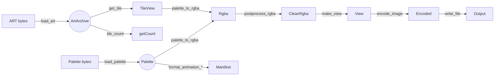

# Architecture Notes — Memory-First API

This document captures the structure of the promoted `art2img::core` API and
its supporting modules.

## 1. Overview

- **Goal:** Provide a simple, memory-first API for converting Build Engine ART
  tiles into modern image formats.
- **Namespaces:**
  - `art2img::core` — parsing, conversion, encoding, and error handling.
  - `art2img::adapters` — file IO, GRP parsing, and manifest formatting.
  - `art2img::extras` — batch helpers that compose the core primitives.

## 2. Data Flow

## 3. Core Types

### 3.1 Error Layer

- `enum class errc { none, io_failure, invalid_art, invalid_palette,
  conversion_failure, encoding_failure, unsupported, no_animation }`
- `struct Error { std::error_code code; std::string message; }`
- Helper functions: `make_error`, `make_error_expected`, `make_success`.

### 3.2 Palette

- `struct Palette { rgb[256*3]; shade_table_count; shade_tables; translucent; }`
- `struct PaletteView { std::span<const std::uint8_t> rgb; shade_tables;
  translucent; std::uint16_t shade_table_count; }`
- `load_palette(std::span<const std::byte>) -> std::expected<Palette, Error>`
- `view_palette(const Palette&) -> PaletteView`

### 3.3 Art Archive

- `struct TileMetrics { width; height; }`
- `struct TileView { std::span<const std::byte> indices; lookup;
  std::uint32_t width; height; }`
- `struct ArtArchive { raw span; layout; offsets; }`
- `load_art(std::span<const std::byte>) -> std::expected<ArtArchive, Error>`
- `tile_count(const ArtArchive&) -> std::size_t`
- `get_tile(const ArtArchive&, std::size_t) -> std::optional<TileView>`

### 3.4 Conversion

- `struct ConversionOptions { bool apply_lookup = true;
  std::optional<std::uint8_t> shade_index{}; }`
- `struct PostprocessOptions { bool apply_transparency_fix = true;
  bool premultiply_alpha = false; bool sanitize_matte = false; }`
- `struct RgbaImage { width; height; std::vector<std::uint8_t> pixels; }`
- `struct RgbaImageView { std::span<const std::uint8_t> pixels; width; height;
  stride; }`
- Functions:
  - `palette_to_rgba(const TileView&, PaletteView, ConversionOptions)`
  - `postprocess_rgba(RgbaImage&, PostprocessOptions)`
  - `make_view(const RgbaImage&) -> RgbaImageView`

### 3.5 Encoding

- `enum class ImageFormat { png, tga, bmp }`
- `enum class CompressionPreset { balanced, fast, smallest }`
- `enum class BitDepth { auto_detect, bpp24, bpp32 }`
- `struct EncoderOptions { CompressionPreset compression; BitDepth bit_depth; }`
- `struct EncodedImage { format; width; height; std::vector<std::byte> bytes; }`
- `encode_image(RgbaImageView, ImageFormat, EncoderOptions) ->
  std::expected<EncodedImage, Error>`
- `file_extension(ImageFormat) -> std::string_view`

## 4. Adapters

- `read_binary_file(const std::filesystem::path&) ->
  std::expected<std::vector<std::byte>, core::Error>`
- `write_file(const std::filesystem::path&, std::span<const std::byte>) ->
  std::expected<void, core::Error>`
- `load_grp(std::span<const std::byte>) -> std::expected<GrpFile, core::Error>`
- `format_animation_ini/json(const core::ExportManifest&) ->
  std::expected<std::string, core::Error>`

## 5. Extras

- `extras::BatchRequest { const core::ArtArchive*; const core::Palette*;
  std::vector<std::size_t> tiles; core::ImageFormat format;
  core::ConversionOptions conversion; core::PostprocessOptions postprocess;
  core::EncoderOptions encoder; }`
- `extras::convert_tiles(const BatchRequest&) ->
  std::expected<BatchResult, core::Error>`

## 6. CLI Summary

1. Accept ART and palette paths plus formatting flags.
2. Read files with `adapters::read_binary_file`.
3. Load archive/palette using `core::load_art` and `core::load_palette`.
4. Iterate tiles, convert to RGBA, post-process, encode, and write files.
5. Report failures by printing `core::Error::message`.

## 7. Testing Priorities

- Validate `load_art` against truncated headers, oversized tiles, and lookup
  offsets.
- Confirm `load_palette` handles varying shade table counts and malformed data.
- Exercise `palette_to_rgba` with lookup and shade variations.
- Verify encoded outputs for PNG/TGA/BMP via known fixtures.
- Maintain GRP parsing unit tests and add IO adapter failure cases.

## 8. Follow-Up Ideas

- Reintroduce optional concurrency in the CLI once coverage stabilises.
- Provide helper utilities for combined ART + palette loading from disk.
- Extend `extras` with streaming/batched encoding strategies if needed.
