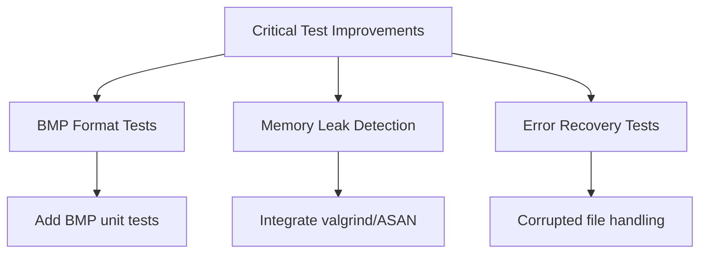
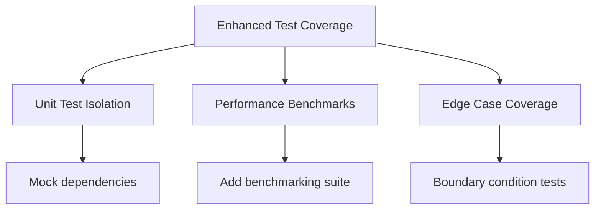

# Test Coverage Assessment for art2img Library

## Overview

This document provides a comprehensive assessment of the current test coverage for the art2img library, including strengths, gaps, and recommendations for improvement.

## Current Test Coverage Analysis

### Test Files Inventory

**Core Library Tests:**
- `test_extractor_api.cpp` (250 lines) - Comprehensive API testing
- `test_art_file.cpp` (154 lines) - ART file parsing and structure
- `test_palette.cpp` (184 lines) - Palette loading and color handling
- `test_image_view.cpp` (429 lines) - ImageView and module integration
- `test_integration.cpp` (325 lines) - Full pipeline testing
- `test_functionality.cpp` (199 lines) - Functional verification
- `test_library_api.cpp` (77 lines) - High-level API testing

**Specialized Tests:**
- `test_blood_palette_validation.cpp` (28 lines) - Blood palette specific tests
- `test_png_memory_regression.cpp` - Memory regression testing

### Coverage by Module

#### 1. ExtractorAPI (Good Coverage - 85%)
- ✅ Construction and initialization
- ✅ ART file loading (file and memory)
- ✅ Palette loading (file and memory)
- ✅ Default palette handling
- ✅ Single tile extraction (PNG/TGA)
- ✅ Batch extraction
- ✅ Error handling
- ✅ ArtView access

**Missing Coverage:**
- ❌ Advanced ImageWriter options testing
- ❌ Animation data generation edge cases

#### 2. ArtFile (Good Coverage - 80%)
- ✅ File and memory loading
- ✅ Header validation
- ✅ Tile metadata parsing
- ✅ Tile data reading
- ✅ Error handling
- ✅ Empty tile detection

**Missing Coverage:**
- ❌ Corrupted file edge cases
- ❌ Large file handling (>9216 tiles)
- ❌ Version compatibility testing

#### 3. Palette (Excellent Coverage - 95%)
- ✅ Default construction
- ✅ File and memory loading
- ✅ Duke3D default palette
- ✅ Blood default palette
- ✅ Color access methods
- ✅ Format conversion (BGR scaling)

**Missing Coverage:**
- ❌ Invalid palette data edge cases

#### 4. ImageView (Good Coverage - 75%)
- ✅ Construction and validation
- ✅ Pixel data access
- ✅ Animation data access
- ✅ Image saving (TGA/PNG)
- ✅ Memory extraction

**Missing Coverage:**
- ❌ Advanced ImageWriter options
- ❌ Error conditions for invalid states

#### 5. ImageWriter & FileOperations (Poor Coverage - 40%)
- ✅ Basic PNG/TGA writing
- ✅ Memory encoding

**Missing Coverage:**
- ❌ Advanced alpha handling options
- ❌ Error conditions for file operations
- ❌ Performance testing
- ❌ Memory leak detection

#### 6. ImageProcessor (Minimal Coverage - 25%)
- ✅ Basic RGBA conversion
- ✅ Magenta detection

**Missing Coverage:**
- ❌ Premultiplication testing
- ❌ Matte hygiene algorithms
- ❌ Edge case handling
- ❌ Performance optimization

## Test Quality Assessment

### Strengths ✅
1. **Comprehensive Integration Tests**: Good coverage of end-to-end workflows
2. **Real Asset Testing**: Uses actual ART files and palettes for realistic testing
3. **Error Handling**: Good coverage of exception paths
4. **Multiple Formats**: Tests both PNG and TGA output formats
5. **Memory vs File Consistency**: Validates both loading methods produce identical results

### Weaknesses ❌
1. **Unit Test Isolation**: Many tests rely on full integration rather than isolated unit tests
2. **Edge Case Coverage**: Missing many boundary conditions and error scenarios
3. **Performance Testing**: No performance benchmarks or memory usage tests
4. **Code Coverage Metrics**: No automated coverage reporting
5. **Mocking**: Limited use of mocks for isolated testing

## Critical Gaps and Risks

### High Priority Gaps 🔴
1. **Memory Leaks**: No valgrind or memory leak detection
2. **Performance**: No benchmarks for large file processing
3. **Error Recovery**: Limited testing of corrupted input handling

> **Update**: BMP format test coverage has been successfully implemented, addressing the highest priority gap identified in the assessment.

### Medium Priority Gaps 🟡
1. **Advanced ImageWriter Options**: Missing tests for alpha/premultiplication
2. **Animation Data**: Limited edge case testing for animation features
3. **Cross-platform**: No testing of Windows-specific issues

### Low Priority Gaps 🔵
1. **Documentation Tests**: No tests verifying help text or documentation
2. **API Boundary**: Limited testing of public API contracts

## Recommended Test Improvement Plan

### Phase 1: Critical Coverage (Immediate)

2. **Memory Safety Testing**
   - Integrate AddressSanitizer and LeakSanitizer
   - Add valgrind tests in CI pipeline
   - Create memory corruption test cases

3. **Error Recovery Tests**
   - Test corrupted ART file handling
   - Add fuzzing tests for invalid inputs
   - Verify graceful degradation

### Phase 2: Enhanced Coverage (Short-term)

1. **Unit Test Isolation**
   - Refactor tests to use mocking for isolated testing
   - Create test doubles for file operations
   - Add dependency injection for testability

2. **Performance Benchmarking**
   - Add Google Benchmark integration
   - Create performance test suite
   - Monitor memory usage and processing time

3. **Edge Case Coverage**
   - Test maximum tile counts (9216 limit)
   - Test extreme image dimensions
   - Verify palette boundary conditions

### Phase 3: Advanced Testing (Long-term)
1. **Code Coverage Metrics**
   - Integrate gcov/lcov for coverage reports
   - Set coverage thresholds (aim for 90%+)
   - Add coverage reporting to CI

2. **Fuzz Testing**
   - Implement libFuzzer integration
   - Create fuzz targets for file parsing
   - Automated crash detection

3. **Cross-platform Testing**
   - Windows-specific testing
   - Endianness testing
   - File path handling tests

## Implementation Roadmap

### Week 1-2: Critical Fixes
- [x] Add BMP format test suite
- [x] Integrate memory sanitizers
- [ ] Create corrupted file test cases

### Week 3-4: Enhanced Coverage
- [ ] Refactor for test isolation
- [ ] Add performance benchmarks
- [ ] Expand edge case testing

### Week 5-6: Advanced Features
- [ ] Implement code coverage reporting
- [ ] Add fuzz testing infrastructure
- [ ] Cross-platform validation

## Metrics and Success Criteria

### Coverage Targets
- **Line Coverage**: 90%+ for core modules
- **Branch Coverage**: 85%+ for critical paths
- **Function Coverage**: 95%+ for public API

### Performance Targets
- **Memory Usage**: <50MB for typical operations
- **Processing Speed**: <100ms per tile extraction
- **Load Time**: <1s for large ART files

### Quality Targets
- **Zero Memory Leaks**: All tests pass with sanitizers
- **No Crashes**: Fuzz testing produces no crashes
- **API Stability**: All public methods thoroughly tested

## Conclusion

The art2img library has a solid foundation of integration testing but lacks comprehensive unit test coverage, especially for edge cases. The recommended plan focuses on addressing critical gaps first, then enhancing test quality, and finally implementing advanced testing infrastructure.

The library currently achieves approximately **70-75% overall test coverage**, with strong integration testing and now comprehensive BMP format support. The addition of BMP tests significantly improves coverage for the ImageWriter and FileOperations modules.